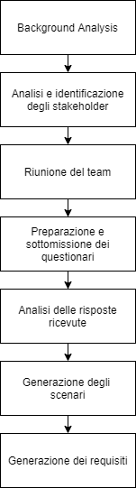
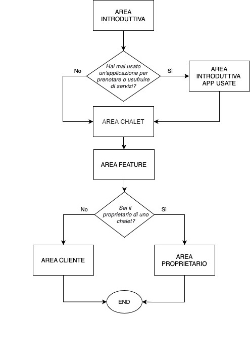

## Assignment 2
### Studenti

| Nome e Cognome  | Mail Unimib | Utente GitLab |
| ---------------- | ------------- | ------------------  |
| Davide Rendina | d.rendina2@campus.unimib.it  |  @daviderendina |
| Gabriele Maria Bucosse  | g.bucosse@campus.unimib.it  | @gabriele_maria_bucosse  |
| Ruggero Panzeri  | r.panzeri12@campus.unimib.it  | @ruggero_panzeri_unimib |

### Repo
[2020_assignment2_booking_seaside_chalet](https://gitlab.com/gabriele_maria_bucosse/2020_assignment2_booking_seaside_chalet)

### Scopo

Definire una strategia per acquisire conoscenze su un prodotto software che deve essere sviluppato, lavorando sull'elicitazione.

## Descrizione Progetto
EasyBeach è un applicazione per permettere agli utenti di poter prenotare ombrelloni negli chalet presso le località di mare. Questa applicazione consente ai clienti di prenotare direttamente l’ombrellone e i lettini presso lo chalet desiderato, attraverso l’utilizzo del proprio smartphone.  
Il posto potrà essere prenotato per un periodo di tempo in base a quanto stabilito dal singolo chalet (es. nello chalet X è disponibile la prenotazione giornaliera, mensile e stagionale, mentre lo chalet Y accetta prenotazioni giornaliere, settimanali e mensili). Per ogni chalet, è possibile per l’utente la consultazione delle tariffe delle diverse combinazioni di ombrellone + lettino, stabilite anche queste dal singolo chalet.
Tramite la piattaforma è possibile inoltre esplorare tutti i servizi disponibili presso lo stabilimento  balneare, come ad esempio eventuale attività di bar e ristorazione (con relativi prezzi) oppure altri servizi gratuiti disponibili (campidi  beach  volley,  docce  fredde,  ..). Il gestore può inoltre comunicare ai clienti, attraverso l’applicazione, diversi sconti e promozioni per tutti i servizi offerti. Il gestore degli chalet potrà inoltre stabilire alcuni sconti e promozioni (es. paga  due  giorni  e  prenota per tre) per determinate giornate o periodi della stagione.
E' possibile inoltre effettuare il pagamento attraverso l'applicazione, utilizzando i servizi di pagamento online più utilizzati. Infine il gestore potrebbe anche essere disponibile la prenotazione tramite app e il pagamento in struttura.

## Piano di elicitazione

Viene ora presentato il piano di elicitazione, approfondito nelle varie attività svolte all'interno dei successivi paragrafi.

1. **Background analysis** si vuole ottenere la conoscenza necessaria riguardante il dominio di riferimento e il system as-is attraverso una loro analisi approfondita e comprensione.

2. **Analisi e identificazione degli stakeholder** al fine di identificare tutti i soggetti in relazione con il sistem to-be, descrivendo anche nel dettaglio perchè e in che modo hanno interesse nei confronti del sistema da sviluppare. 
<!--Per questa attività verra effettuato un brainstorming tra gli sviluppatori del progetto, utilizzando per l'identificazione le informazioni recuperate dalla _background analysis_ e le domande proposte nelle slide (assolutamente da cambiare - magari tutta questa frase va descritta nella parte dove descriviamo bene l'analisi)-->
3. **Riunione del team** per definire gli obiettivi del system to-be e identificare i primi requisiti.

4. **Preparazione e sottomissione dei questionari** saranno preparati i questionari da sottoporre alle varie tipologie di stakeholder. In particolare verrà preparato un questionario per ogni stakeholder ritenuto significativo per la scoperta di nuovi requisiti.

5. **Analisi delle risposte ricevute dai questionari** le risposte ricevute dai questionari saranno analizzate per comprendere il punto di vista degli stakeholder riguardo temi particolari e definire i requisiti in base alle risposte ricevute.

6. **Generazione degli scenari e discussione con gli stakeholder** verranno inoltre generati gli scenari più significativi dell'applicazione, per comprendere al meglio la gestione di situazioni particolari che potrebbero verificarsi.

7. **Definizione dei requisiti** infine saranno generati i requisiti dell'applicazione analizzando le informazioni ricevute da tutte le attività svolte.

## Descrizione approfondita delle attività svolte

### 1. Background Analysis

Obiettivo dell'attività di background analysis è la definizione delle caratteristiche del system as-is. Avendo già il team le conoscenze necessarie per il dominio di riferimento, non è stato necessario accedere a documenti e informazioni particolari.
Viene riportato di seguito ciò che il team è stato in grado di scoprire durante questa attività (TODO: forse va messo nell'appendice)

#### System as-is
- I clienti attualmente per prenotare gli chalet si recano personalmente sul posto o chiamano per telefono. 
- Se scelgono di recarsi sul posto ma trovano uno chalet completamente occupato oppure che ha un prezzo troppo elevato secondo le loro esigenze, si spostano verso il successivo.
- Se invece provano a chiamare lo chalet per verificare la disponibilità oppure i costi di un determinato chalet ma non lo considerano adatto oppure non risulta disponibile, devono effettuare una chiamata allo chalet successivo.
- Per la ricerca dei numeri di telefono possono utilizzare un'agenda telefonica oppure diversi servizi presenti sul web (ricerca con Google, pagine degli stabilimenti sui social network, ecc..). 
<!-- - Si segnala che è più probabile che le piattaforme web (più immediate nella ricerca) siano preferite da un utenza più giovane mentre per persone non esperte con la tecnologia è probabile venga utilizzato il primo metodo. -->
- Anche per la consultazione di servizi disponibili presso lo stabilimento ed eventuali menù/prezzi vengono utilizzati i metodi presentati in precedenza (contatto telefonico o recarsi sul posto).
- La reputazione degli chalet viene condivisa tramite passaparola senza un garante di veridicità.

    ##### PRO
    - Miglior interazione sociale
    - Adatto a tutte le fasce di età, anche per chi non è pratico con la tecnologia

    ##### CONS
    - Spreco di tempo
    - Nessuna garanzia di riuscita 
    - Nessuna garanzia di qualità
    - Difficile espanione
    - Notorietà degli chalet limitata
    - Difficoltà nel presentare eventuali offerte o promozioni

### 2. Identificazione degli stakeholder

#### Stakeholders primari:

##### Team di sviluppo:
- Punta alla ottima riuscita del progetto, per un rendiconto personale

##### Proprietari/Gestori chalet balneari: 
- Vogliono rendere visibile, in tempo reale, la disponibilità del proprio servizio.
- Vogliono incrementare i profitti
- Vogliono incrementare il loro bacino di utenza

##### Clienti:
- Vogliono conoscere i vari locali che offrono quel determinato servizio
- Vogliono poter confrontare le varie offerte proposte
- Vogliono avere una possibilità di prenotare facilmente e velocemente
- Vogliono poter leggere/scrivere recensioni

##### Fornitori:
- Vogliono che il progetto abbia successo perchè loro guadagneranno tramite il numero clienti che scaricheranno l'app.

#### Stakeholders secondari:

##### Competitori:
- Altri servizi di booking: la loro utenza potrebbe diminuirsi a causa di questa applicazione.

#### Stakeholders scelti per i questionari:
- Proprietari/Gestori: vogliamo sapere quali funzionalità potrebbero apprezzare, in quale modo vorrebbero averle a disposizione, e gli aspetti più e meno interessanti tramite i quali l'applicazione potrebbe suscitare o meno interesse.

- Clienti: vogliamo sapere quali funzionalità potrebbero apprezzare, consigli su servizi che vorrebbero avere all'interno dell'applicazione, e la qualità generale del servizio.

### 3. Riunione del team

Nel processo di elicitazione, dovrebbe essere effettuato un primo studio delle funzionalità di EasyBeach, per effettuare una valutazione preliminare dei possibili requisiti del system-to-be, tenendo conto anche del dominio del software, utile al fine di creare un questionario mirato. Per questo motivo, in questo punto è presentato un ragionamento delle possibili funzionalità che abbiamo identificato, le quali dovrebbero essere presenti nell'app.

- Tutti possono accedere all'app, ma solamente chi si registra all'interno dell'app potrà: o inserire la propria struttura nel caso dei gestori, o effettuare qualunque tipo di prenotazione nel caso dei clienti.

- Per inserire il proprio chalet nell'app, il gestore dovrà superare il controllo di verifica di identità durante la registrazione.

- Ogni struttura sarà identificata attraverso il proprio nome.

- Ogni struttura inserita avrà la propria pagina con: foto, posizione sulla mappa, descrizione, relativo costo di ogni servizio offerto, sezione recensioni.

- Ogni struttura potrà essere ricercata/classificata da chiunque utilizzi l'app in base ad alcuni filtri sulla ricerca, basati sulle preferenze riguardo: servizi offerti, prezzi, metodi di pagamento etc.

- I clienti registrati potranno effettuare qualunque tipo di prenotazione per la struttura scelta, secondo le regole imposte da ogni struttura (Ad esempio pagamento immediato, pagamento in struttura, cancellazione gratuita etc.)

- I clienti, dopo aver effettuato la prenotazione ed aver terminato l'esperienza presso la struttura prenotata, potranno scrivere una recensione in merito alla stessa

- I gestori/personale della struttura, terminata l'esperienza del cliente, potranno dare fare una recensione al cliente.

- Per qualsiasi problematica riscontrata da qualunque utente all'interno dell'app, sarà presente una sezione "contattaci", nella quale sarà avviato un collegamento diretto con i manutentori dell'applicazione tramite mail o tramite live chat.

### 4. Preparazione e sottomissione dei questionari

*Quanti anni hai?*
Comprensione dell'età dello stakeholder, per analizzare al meglio le esigenze di ogni fascia di età.

*Hai mai usato un'applicazione per prenotare o usufruire di servizi?*
Analizzare se l'utente ha dimestichezza con altri sistemi di prenotazione online, per analizzare le risposte in base alle esperienze passate. 

### 5. Analisi delle risposte ricevute dai questionari
### 6 Generazione degli scenari e discussione con gli stakeholder
### 7. Definizione dei requisiti

